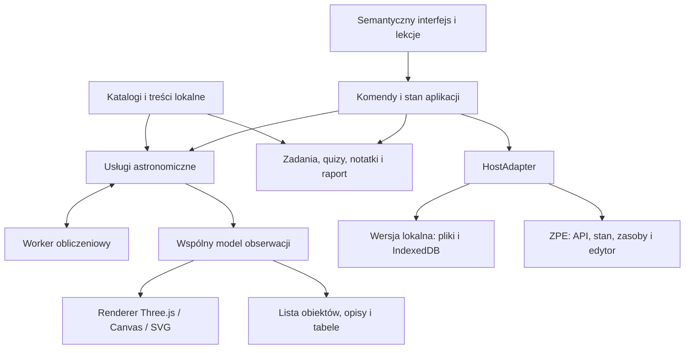

# Plan projektu „Niebo nad nami” — VII.6

Wersja 1.2 • 3 października 2026 • rozpoczęta implementacja P0

**Doprecyzowanie użytkownika z 05.10.2026 — E8.1:** scenariusz wymaga linków
do filmów edukacyjnych. Realizacja E8.1 polega na polskojęzycznych odsyłaczach
YouTube, bez kopiowania filmów i hostowania MP4 w projekcie. Wcześniejsze
zapisy o produkcji plików filmowych w E8.1 należy czytać z tym doprecyzowaniem.
Pozostałe plany narracji i mediów tworzonych przez projekt pozostają osobnym
zakresem. Decyzję i aktualny stan zapisano w [ADR 012](app/docs/adr/012-p4-edytor-zadania-zpe-filmy.md).

**Ustalenie użytkownika z 03.10.2026 — najpierw lokalnie:** pierwszym celem jest uruchomienie i weryfikacja wersji lokalnej. Początkowe wydania mogą nie spełniać wszystkich wymagań ZPE. Brak dostępu do platformy i niezamknięte próby ZPE w G0 nie blokują prac lokalnych, w tym lokalnej części P1 po sprawdzeniu jej wejść. Otwarte kryteria platformowe są nadal śledzone i obowiązują przed odbiorem ZPE. Pozostałe decyzje merytoryczne, licencyjne i dostępnościowe nie są przez to automatycznie rozstrzygnięte. Zakres dydaktyczny pozostaje bez zmian. Szczegóły i dowody prac: [POSTEP_PRAC.md](POSTEP_PRAC.md).

**Decyzja architektoniczna:** aplikacja przeglądarkowa z jednym rdzeniem obliczeń i treści, uruchamiana lokalnie oraz jako komponent ZPE. Proponowany stos: TypeScript, modułowy interfejs DOM, CSS, Three.js, Astronomy Engine, Web Worker, Vite oraz osobny proces budowania AMD/ES5 dla ZPE. Dane i obowiązkowe multimedia są dostarczane z aplikacją.

**Rezultat końcowy:** dostępne w języku polskim wirtualne obserwatorium, osiem ekranów edukacyjnych ze scenariusza, eksploracja swobodna, zadania, quizy, notatki, historia obserwacji, raporty oraz edytor konfiguracji dla nauczyciela. Wersja lokalna działa przez mały serwer statyczny na komputerze użytkownika; nie wymaga konta, zewnętrznej bazy danych ani serwera obliczeń.

Plan obejmuje pełny materiał. Wczesny prototyp służy sprawdzeniu ryzyk technicznych i nie jest traktowany jako zakończenie projektu. Wszystkie polecenia, struktury kodu i interfejsy opisane poniżej są projektowane, a nie już zaimplementowane.

## 1. Podstawa planu i stan początkowy

Przeanalizowano wszystkie 13 stron załączonego scenariusza, strukturę gałęzi `main` repozytorium i dokumentację ZPE z repozytorium. Szczegółowa [macierz 74 wymagań](MACIERZ_WYMAGAN.md) łączy zakres ze źródłami, modułami i kryteriami odbioru. [Lista prac implementacyjnych](ZADANIA_IMPLEMENTACYJNE.md) określa kolejność, zależności, odpowiedzialności i dowody ukończenia 28 pakietów prac.

| Oznaczenie | Źródło | Znaczenie dla projektu |
|---|---|---|
| S | „Scenariusz dla zaawansowanego e-materiału_Nr_VII.6.docx (2).pdf”, autor Krzysztof Rochowicz, 13 stron | Zakres dydaktyczny, 8 ekranów, mechanika, dostępność, funkcje nauczyciela |
| U | Wymagania użytkownika w tej rozmowie | Uruchomienie lokalne, modularność, niebieska estetyka, symulacja 3D |
| Z11 | Załącznik nr 11: ogólne wymagania funkcjonalne i techniczne, 19 stron | Wymagania odbioru, wydajność, personalizacja, multimedia, dokumentacja |
| Z13 | Załącznik nr 13: wytyczne treści audiowizualnych, aktualizacja 24.06.2024, 7 stron | Parametry grafik, filmów, nagrań, napisów i zasady produkcji |
| API | Dokumentacja techniczna komponentów interaktywnych, aktualizacja 03.02.2026, 28 stron | ES5, AMD/UMD, stan, edytor, zasoby, WebGL i współpraca z LMS |
| R | README, CLAUDE.md, layout aplikacji symulacyjnej oraz kod VII.02/VII.03 | Konwencje repozytorium i istniejące przykłady integracji |

Przegląd repozytorium dotyczy commitu `c99d53bca40fe5d68b7a29aefb6201b4d13d1cc3`. Folder VII.06 zawiera README i puste katalogi robocze. Foldery `shared/komponenty`, `shared/a11y-menu` i pozostałe wspólne mechanizmy nie stanowią obecnie gotowej biblioteki kodu: należy zaplanować ich wykonanie albo świadome wydzielenie z VII.02/VII.03. Dokumentacja layoutów jest dostępna.

Załączony plik źródłowy znajduje się pod ścieżką `C:/Users/Tomek/Downloads/Scenariusz dla zaawansowanego e-materiału_Nr_VII.6.docx (2).pdf`. Jego SHA-256: `B0D1602D1D150A4831BF317BDED8BEF4FF94068CB1ED818456B03A49B2D983F1`. Oznaczenia stron odnoszą się do numeracji tego dokumentu.

Treści dokumentów potraktowano jako wymagania produktu i materiał do analizy. Nie są poleceniem publikowania, zmiany zewnętrznych systemów ani kontaktowania się z osobami wymienionymi w dokumentach.

## 2. Zakres produktu i decyzje wymagające potwierdzenia na etapie realizacji

### Zakres pierwszego pełnego wydania

- Ekran powitalny, konfiguracja dostępności przed wejściem, osobny onboarding i sześć kroków wprowadzenia multimedialnego z S, s. 3–4.
- Wszystkie ekrany E1–E8 i wymienione w nich sceny, opisane w rozdziale 3.
- Obserwacja z dowolnych współrzędnych geograficznych; wyszukiwarka miejsc, lista miejsc przykładowych, historia i lokalna mapa Ziemi.
- Czas rzeczywisty, pauza, przyspieszanie, zwalnianie, cofanie i skoki do daty lub zdarzenia; lokalna strefa czasowa prezentowana jawnie.
- Słońce, Księżyc, planety obserwowane z Ziemi, gwiazdy, gwiazdozbiory, wybrane mgławice i galaktyki; katalog edukacyjny obejmujący również Ziemię, inne księżyce, planetoidy i komety.
- Klikanie lub wybór obiektu z dostępnej listy, śledzenie obiektu, informacje, rzeczywisty rozmiar kątowy, widok teleskopowy i osobny schemat orbitalny 3D.
- Zadania praktyczne, pomiary, hipotezy, wnioski, quizy, test przekrojowy, słownik i prostsze wersje treści.
- Zapis ustawień, historii miejsc, odpowiedzi i postępów; raport sesji ucznia oraz narzędzia konfiguracji i raportowania nauczyciela.
- Działanie obowiązkowych funkcji bez internetu po dostarczeniu paczki oraz integracja z ZPE w osobnym wariancie kompilacji.

**Proponowany, liczbowy zakres treści do zamrożenia w G0:** katalog około 6–10 tysięcy jasnych gwiazd, orientacyjnie do jasności 6,5 mag; 88 nazw/obszarów gwiazdozbiorów, rozbudowane omówienia co najmniej pięciu wskazanych w scenariuszu; około 30 szczegółowych kart obiektów, w tym Syriusz, Betelgeza, Gwiazda Barnarda, M31, M42, wybrane księżyce Jowisza, jedna planetoida i jedna kometa. Dokładny katalog zależy od jakości i warunków wykorzystania danych. Nie zakładamy, że dla każdej gwiazdy znana jest masa, promień lub wiarygodne zdjęcie: nieznane wartości pozostają oznaczone jako brak danych.

Plan zakłada 18 zadań praktycznych, minimum 40 pytań w banku i konfigurowalny test przekrojowy. To propozycja produkcyjna, nie liczby narzucone w PDF. Każdy cel dydaktyczny musi mieć pokrycie w treści i sprawdzeniu wiedzy, niezależnie od ostatecznej liczby pytań.

### Rozstrzygnięcia źródeł

| Kwestia | Rozwiązanie projektowe | Warunek odbioru / decyzji |
|---|---|---|
| Lokalna SPA i docelowy komponent ZPE | Wspólny rdzeń, dwa adaptery środowiska oraz edytor | Próbka tej samej lekcji działa w obu środowiskach w G0 |
| Nowoczesne biblioteki a ES5 | TypeScript jako kod źródłowy; pełny wynik ZPE, także zależności i Worker, kompilowany i sprawdzany jako ES5 | Sam Babel nie gwarantuje zgodności API przeglądarki; testujemy też rzeczywiste środowiska |
| Przeglądarki i urządzenia | API z 2026 r. wymienia Edge 94 i Safari/iOS 17+; Z11 urządzenia iOS 14+; Z13 z 2024 r. Edge 79+ i Safari/iOS 13+ | Do testu prototypu przyjmujemy nowszą macierz API. Starsze konfiguracje pozostają jawną decyzją G0; wspólny widok Canvas/SVG ogranicza zależność od WebGL2, ale nie dowodzi zgodności wszystkich API przeglądarki |
| „WCAG w miarę możliwości” w opisie użytkownika i obowiązek w scenariuszu | Plan przyjmuje dostępność jako kryterium ukończenia; techniczny cel WCAG 2.2 AA | Dokładną podstawę kontraktową z daty naboru odnotować w G0; dodatkowe 2.2 nie obniża wymagań źródłowych |
| Panel nauczyciela a konwencje repozytorium | W ZPE konfiguracja w edytorze komponentu, przegląd uczniów w LMS; lokalnie osobna strona narzędzi nauczyciela | Funkcje ze s. 13 pozostają w zakresie, ale nie obciążają interfejsu ucznia |
| Raport zbiorczy klasy | Lokalnie import wyeksportowanych raportów; w ZPE podgląd stanu wybranego ucznia i mechanizmy LMS | Dokumentacja API nie daje ogólnego API pobierania wyników całej klasy; potwierdzić ten przebieg w G0 |
| Linki i wideo E8 a zakaz zewnętrznych usług | Obowiązkowe multimedia w paczce; źródła internetowe jako opisane pozycje bibliograficzne, otwierane świadomie | Żadne automatyczne żądanie do YouTube, CDN, map lub Horizons; odsyłacze zgodne z zasadami ORE |
| AR/VR i OpenXR | S, s. 1 wskazuje standardową aplikację 2D/3D i niezaznaczone AR/VR | Ogólne zapisy Z11 o OpenXR przypisać do właściwego zakresu w G0; nie dodawać VR bez decyzji o rozszerzeniu |
| Profesjonalny lektor | Budżet i harmonogram obejmują nagrania człowieka, napisy i transkrypcje | Z11 przewiduje szczególną procedurę odstępstwa dla syntezy; plan jej nie zakłada |

Żadna z tych kwestii nie uniemożliwia przygotowania planu. Decyzje integracyjne mają być zamknięte przed rozbudową aplikacji, a nie przy końcowym wdrożeniu.

## 3. Ekrany, sceny i przebieg dydaktyczny

Ekran powitalny i onboarding są warstwą wejścia. Nie zastępują ośmiu ekranów merytorycznych. Nawigacja zachowuje ich numerację. Dodatkowe menu tematyczne z S, s. 4–5 prowadzi do odpowiednich scen, kart obiektów i narzędzi; temat „Ciała niebieskie” otwiera katalog dostępny z całego materiału.

| Ekran / źródło | Sceny i treść | Interakcja i sprawdzenie wiedzy |
|---|---|---|
| Start i onboarding; S 3–4, 9–10; Z11 3–4 | Tytuł, „Rozpocznij”, ustawienia dostępności, instrukcja, miejsce na dostarczone logotypy; następnie poziom i sześć kroków: otwarcie, interfejs, lokalizacja, obiekt, ruch, podsumowanie | Tutorial można pominąć i powtórzyć. Muzyka i narracja dopiero po działaniu użytkownika; napisy dostępne wcześniej. Pierwszy wybór obiektu i pauza symulacji |
| E1 Wprowadzenie; S 5–6 | Scena 1: sfera, ekliptyka, równik, zenit, horyzont; dodatkowo nadir i bieguny z części teoretycznej | Przełączanie oznaczeń; wskazanie zenitu i horyzontu, także poprzez listę; krótki wykład z transkrypcją |
| E2 Sfera niebieska; S 6 | 2.1 definicja; 2.2 współrzędne; 2.2.1 rektascensja/deklinacja; 2.2.2 wysokość/azymut | Jednoczesny odczyt obu układów, przełączanie siatek; zmiana miejsca przy tej samej chwili UTC; zadanie ustawienia kierunku według współrzędnych |
| E3 Gwiazdozbiory; S 6 | 3.1 pojęcie, historia i kultury; 3.2 przykłady; 3.2.1 Wielka Niedźwiedzica, Kasjopeja i Orion; 3.2.2 Krzyż Południa i Centaur | Nazwy, wzory i granice; porównanie nieba z półkuli północnej i południowej; mity oddzielone od wiedzy naukowej; znalezienie Oriona |
| E4 Ruchy; S 4, 6 | 4.1 ruch własny i pozorny, Gwiazda Barnarda; dodatkowa scena precesji; 4.2 ruchy planet; 4.2.1 prosty i wsteczny; 4.2.2 trzy prawa Keplera; ruch roczny i pory roku z celów ogólnych | Ślady ruchu, porównanie doby/roku; pętla Marsa; powiązanie widoku z Ziemi ze schematem heliocentrycznym; równe pola w równych czasach; zależność T² od a³ |
| E5 Obserwacje; S 6–7 | 5.1 miejsce, czas, wyposażenie; 5.2 gwiazdy i gwiazdozbiory, Syriusz i Betelgeza; 5.3 planety, fazy Księżyca, koniunkcja i opozycja; 5.4 zjawiska rzadkie; 5.4.1 zaćmienia i bezpieczna obserwacja; 5.4.2 Perseidy i Leonidy | Plan obserwacji i dziennik; porównanie wschodów Słońca w porach roku; miesiąc faz Księżyca; geometria zaćmienia i widoczność lokalna; radiant i przykładowe ślady meteorów |
| E6 Narzędzia; S 7 | 6.1 refraktor, reflektor, lornetka; 6.2 fotografia i analiza zdjęć; 6.3 Stellarium, SkySafari i planowanie obserwacji | Dobór ogniskowej/okularu, pola widzenia i powiększenia; model teleskopu 3D; porównanie oka, okularu i długiej ekspozycji; zadanie wyboru narzędzia |
| E7 Podsumowanie; S 7, 13 | 7.1 przegląd treści; 7.2 rola astronomii w nauce i kulturze; wyniki i historia | Test przekrojowy, powrót do błędnych odpowiedzi, ponowne próby; refleksja do dyskusji; raport i eksport obserwacji |
| E8 Materiały dodatkowe; S 7 | 8.1 filmy; 8.2 symulacje; 8.3 literatura i zasoby internetowe | Opisane zasoby z informacją o dostępności offline, źródle, licencji i poziomie; treść podstawowa dostępna bez opuszczania aplikacji |

### Trzy poziomy i dwa tryby

Poziom podstawowy przedstawia pojęcia prostym językiem i ogranicza liczbę widocznych kontrolek. Rozszerzony wprowadza współrzędne, pomiary i wykresy. Ekspercki udostępnia m.in. modele orbitalne, tolerancje i analizę niepewności. Poziom nie jest sztywnym przypisaniem do wieku; nauczyciel może ustawić domyślny zakres, a treści nadal mają spójne identyfikatory.

Tryb „Odkrywaj” pozwala swobodnie zmieniać czas, miejsce i warstwy. Tryb „Ucz się” uruchamia scenę z celem, ustawieniami początkowymi, krótkim wyjaśnieniem, hipotezą, eksperymentem i wnioskiem. Wejście do zadania zapamiętuje poprzedni widok; wyjście pozwala do niego wrócić. Instrukcja oraz pomoc są dostępne stale.

### Przykłady zadań gotowych do rozpisania na testy

| Zadanie | Działanie ucznia | Sprawdzanie |
|---|---|---|
| Z01 — Gdzie jest Mars? | Przy zadanej dacie i miejscu wybiera Marsa na mapie albo dostępnej liście | Identyfikator obiektu; data zadania gwarantuje dostępność celu; nie oceniamy precyzji ruchu myszy |
| Z02 — Wysokość i azymut | Ustawia wskaźnik na zadanych współrzędnych | Odległość kątowa od celu, np. tolerancja 2° dla podstawowego poziomu; zgodny odczyt tekstowy |
| Z03 — Droga Słońca | Zbiera wschód, górowanie i zachód dla czterech dat w jednym miejscu | Komplet obserwacji i poprawne porównanie; wnioski otwarte przeznaczone do oceny nauczyciela |
| Z04 — Fazy Księżyca | Zapisuje obserwacje z czterech faz i łączy je z geometrią Słońce–Ziemia–Księżyc | Rozpoznanie faz i właściwa kolejność; system nie utożsamia faz ze zwykłym cieniem Ziemi |
| Z05 — Pętla Marsa | Porównuje kierunek ruchu Marsa na tle gwiazd w kolejnych dniach | Wskazanie odcinka ruchu wstecznego i poprawne wyjaśnienie zmiany perspektywy |
| Z06 — Teleskop | Dobiera okular i przewiduje zmianę pola widzenia | Poprawna zależność powiększenia i pola; uwzględniony limit szczegółowości |

Ukończenie zadania wymaga osiągnięcia celu lub oddania uzasadnionego wyniku. Liczba użytych suwaków i czas spędzony w scenie nie są samodzielną miarą opanowania materiału. Brak limitów czasu, kar za ponowne próby i automatycznej oceny otwartych wypowiedzi przez AI.

## 4. Wybrane technologie

| Obszar | Wybór | Uzasadnienie i ograniczenie |
|---|---|---|
| Język | TypeScript, tryb `strict` | Typy dla jednostek, współrzędnych, scen, wiadomości Workera i stanu; wynik ZPE przechodzi osobną kompilację ES5 |
| UI | Małe komponenty TypeScript tworzące semantyczny DOM | Kontrola fokusa, izolacji instancji i zależności; dobre dopasowanie do stylu kodu VII.02/VII.03. UI nie potrzebuje osobnego frameworka do renderowania każdej klatki symulacji |
| Grafika | Three.js, renderer WebGL2; SVG dla schematów i wykresów; Canvas 2D jako dostępny na wszystkich poziomach jakości widok mapy | Jeden model danych zasila różne prezentacje. Aktualny WebGLRenderer Three.js wymaga WebGL2; brak WebGL1 od r163. [Dokumentacja](https://threejs.org/docs/pages/WebGLRenderer.html) |
| Astronomia | `astronomy-engine` za własnym interfejsem | Pozycje głównych ciał i zdarzenia; biblioteka deklaruje dokładność około 1 minuty łuku i licencję MIT. Wynik całej aplikacji wymaga niezależnej walidacji. [Źródło](https://github.com/cosinekitty/astronomy) |
| Obliczenia w tle | Dedykowany Web Worker; alternatywnie krótkie porcje obliczeń na głównym wątku | Płynny interfejs podczas wyszukiwania zdarzeń i torów; wybór zależny od obsługi Workera i zasad CSP hosta |
| Stan | Mały store z komendami i selektorami | Oddzielenie ustawień trwałych, stanu lekcji i chwilowych buforów renderowania; brak zapisu całej sceny 3D |
| Dane treści | JSON z wersjonowanymi schematami i walidacją | Treści, quizy i słownik edytowalne bez ingerencji w algorytmy; walidatory przygotowane w buildzie, bez `eval` w przeglądarce |
| Pamięć lokalna | IndexedDB dla sesji i wyników; małe preferencje w localStorage za adapterem | Brak SQLite/WASM i backendu; obsługa odmowy dostępu, limitów pamięci i eksportu ręcznego |
| Czas | UTC w modelu, IANA strefy i `Intl` w prezentacji, jawnie testowana konwersja czasu lokalnego | Brak założenia, że zmiana długości geograficznej wyznacza urzędową strefę; bez zależności od nowego globalnego Temporal |
| Styl | CSS z tokenami, Flexbox/Grid, modułowe pliki i prefiks `.nnb` | Proste niebieskie UI; w ZPE fonty platformy i izolacja od motywu strony |
| Praca lokalna | Vite, npm, Node.js 22 w wersji co najmniej 22.12 | Dokładne wersje zatwierdzane w G0, zapisane w `.node-version` i lockfile; Vite dokumentuje ten próg dla linii 22. [Wymagania](https://vite.dev/guide/) |
| Build ZPE | Osobny skrypt Node.js: Rollup do AMD, Babel, Terser, PostCSS, Acorn | Kontrola całego wyniku, w tym zależności; Vite służy lokalnej pracy, a zgodność ZPE jest osobnym kontraktem |
| Testy | Vitest, Playwright, axe-core oraz ręczne testy czytników | Testy obliczeń, przepływów, dostępności i integracji; automaty nie stanowią pełnego audytu |
| Zasoby | Lokalne PNG/JPG/SVG, modele glTF/GLB, MP4, MP3 i WebVTT | Profile przekazania wynikają z Z13 i są opisane w rozdziale 12. Format modeli 3D jest decyzją techniczną do sprawdzenia w G0, a nie formatem narzuconym w Z13 |

Biblioteki mają być dostarczone w paczce z informacją o licencjach. Wersje będą przypięte po próbie zgodności, a nie pobierane automatycznie jako `latest` przy każdym uruchomieniu. Unikamy patchowania `window`, prototypów i globalnych polyfilli; API wyraźnie tego zabrania.

## 5. Architektura i odpowiedzialności



| Moduł | Odpowiedzialność | Granica |
|---|---|---|
| `app` | Cykl życia, nawigacja, store, komendy, poziom i tryb | Nie wykonuje efemeryd ani bezpośredniego zapisu w ZPE |
| `domain` | Jednostki, struktury danych, reguły zadań, identyfikatory | Brak DOM, Three.js i API platformy |
| `astronomy` | Pozycje, układy współrzędnych, zdarzenia, fazy, orbity, dokładność | Zwraca dane liczbowe i status jakości; nie decyduje o kolorach lub nawigacji |
| `simulation` | Zegar, bufor obserwacji, harmonogram obliczeń, cache torów | Steruje czasem symulowanym niezależnie od FPS |
| `rendering` | Mapa nieba, kamera, warstwy, teleskop i schemat orbitalny | Korzysta z danych obliczonych; nie posiada odpowiedzi do quizów |
| `education` | Ładowanie scen, przebieg zadania, ocena automatyczna i wnioski otwarte | Każdy cel ma identyfikator i odwołanie do źródła |
| `ui` i `accessibility` | Kontrolki, karty, lista obiektów, fokus, komunikaty, personalizacja | Korzystają z tych samych komend co mapa |
| `data` | Wczytanie i walidacja katalogów, treści i konfiguracji | Każdy plik ładowany przez resolver hosta |
| `persistence` i `reports` | Wersjonowanie stanu, migracje, eksport, raport | Oddzielone dane lekcji, preferencje i zasoby |
| `hosts` | Lokalny host, komponent ZPE, lokalne narzędzia nauczyciela | Cała zależność od platformy pozostaje tutaj |
| `editor` | Konfiguracja warstw, treści, zadań i quizów | Wspólny model konfiguracji lokalnie i w edytorze ZPE |

### Przepływ jednej zmiany

1. Użytkownik zmienia datę; UI wysyła komendę `SetInstant` po walidacji strefy i wartości.
2. Store aktualizuje chwilę UTC i zwiększa numer rewizji obliczeń.
3. Usługa astronomiczna zleca obliczenia Workerowi z identyfikatorem rewizji, datą, obserwatorem i żądanym zestawem ciał.
4. Worker zwraca tablice pozycji oraz metadane: układ, epokę, jednostki i zakres ważności. Wyniki dla nieaktualnej rewizji są odrzucane.
5. Renderer, dostępna lista i zadanie otrzymują ten sam model obserwacji. Czytnik dostaje zwięzłe podsumowanie po zakończeniu zmiany.
6. Adapter zapisuje istotny stan z opóźnieniem grupującym zmiany. Klatki animacji nie powodują osobnych zapisów.

Worker ma kolejkę z możliwością anulowania długich wyszukiwań. Przesyłamy małe tablice liczb, nie tysiące obiektów DOM. Utrata Workera uruchamia ograniczony harmonogram obliczeń na głównym wątku i nie usuwa wyników ucznia.

### Projekt kontraktu hosta

```ts
interface HostAdapter {
  resolveAsset(path: string, scope: 'engine' | 'lesson'): string;
  loadStyles(path: string): Promise<void>;
  notifyStateChanged(): void;
  requestFullscreen(container: HTMLElement): Promise<void>;
  getEnvironment(): HostEnvironment;
  dispose(): void;
}
```

To szkic interfejsu implementacyjnego. W ZPE `notifyStateChanged()` wywołuje `api.triggerStateSave()`, a platforma pobiera stan przez `getState()`. Model nie zakłada własnej funkcji zapisu do serwera ZPE. Stan dostarczony przed zakończeniem ładowania danych jest buforowany i stosowany atomowo po gotowości rdzenia.

## 6. Struktura katalogów

W repozytorium kod aplikacji powinien znajdować się wewnątrz materiału VII.06. Proponowany nowy folder `app/` oddziela implementację od numerowanych katalogów treści. Odstępstwo od dotychczasowego layoutu należy wpisać w README materiału.

```text
emateria-y/
├── Dokumenty projektowe/
├── Scenariusze bazowe ORE/
├── shared/                         # wspólny kod wydzielany po sprawdzeniu użycia
└── e-materialy/
    └── VII.06-niebo-nad-nami_aplikacja-symulacja-nieba/
        ├── README.md
        ├── 01-wsad/                # materiały źródłowe, rejestr źródeł
        ├── 02-scenariusz/          # plan, matryca scen, teksty lektora
        ├── 03-makieta/             # projekty UI, eksporty i uwagi
        ├── 04-ekrany/
        │   ├── ekran-01-wprowadzenie/
        │   ├── ekran-02-sfera/
        │   ├── ekran-03-gwiazdozbiory/
        │   ├── ekran-04-ruchy/
        │   ├── ekran-05-obserwacje/
        │   ├── ekran-06-narzedzia/
        │   ├── ekran-07-podsumowanie/
        │   └── ekran-08-materialy/
        ├── 05-zadania/             # definicje JSON i kryteria oceny
        ├── 06-quizy/               # bank pytań
        ├── 07-slownik/             # treści i wariant prostym językiem
        ├── 08-test-przekrojowy/    # skład testu i zasady punktacji
        ├── 09-recenzja/            # uwagi, odpowiedzi i raporty odbioru
        └── app/
            ├── index.html         # wejście Vite w katalogu głównym aplikacji
            ├── teacher.html       # lokalne narzędzia nauczyciela
            ├── package.json
            ├── package-lock.json
            ├── .node-version
            ├── tsconfig.json
            ├── vite.config.ts
            ├── rollup.zpe.config.mjs
            ├── babel.zpe.config.cjs
            ├── .gitignore
            ├── public/
            │   └── assets/
            │       ├── images/
            │       ├── textures/
            │       ├── models/
            │       ├── audio/
            │       ├── video/
            │       └── captions/
            ├── catalogs/          # opracowane dane astronomiczne i metadane
            ├── schemas/           # JSON Schema: scena, zadanie, stan, konfiguracja
            ├── licenses/          # licencje bibliotek, danych i mediów
            ├── src/
            │   ├── app/           # App, store, komendy, routing wewnątrz kontenera
            │   ├── domain/        # typy, jednostki, walidacja
            │   ├── astronomy/     # adapter Astronomy Engine i transformacje
            │   ├── simulation/    # zegar, harmonogram, cache
            │   ├── workers/       # ephemeris.worker.ts, protokół wiadomości
            │   ├── rendering/
            │   │   ├── sky/        # gwiazdy, planety, siatki, gwiazdozbiory
            │   │   ├── orbital/    # Kepler, pory roku, geometria zaćmień
            │   │   ├── telescope/
            │   │   └── canvas/     # wspólny alternatywny renderer mapy
            │   ├── education/     # runner scen, zadania, quiz, słownik
            │   ├── ui/            # Navigation, TimeControls, LocationPicker,
            │   │                  # ObjectInspector, ObjectList, Notebook
            │   ├── accessibility/ # fokus, komunikaty, preferencje, klawiatura
            │   ├── data/          # repozytoria i resolver zasobów
            │   ├── persistence/   # zapis, wersje i migracje
            │   ├── reports/       # podsumowanie, CSV/JSON, widok do druku
            │   ├── editor/        # konfiguracja lekcji i tworzenie pytań
            │   ├── hosts/
            │   │   ├── standalone/# main.ts, LocalHostAdapter
            │   │   └── zpe/       # entry.ts, editor.ts, ZpeHostAdapter
            │   ├── i18n/          # pl, formatowanie i mechanizm kolejnych języków
            │   └── styles/        # tokeny, komponenty, kontrasty, druk
            ├── tools/
            │   ├── prepare-content.mjs
            │   ├── prepare-catalogs.mjs
            │   ├── build-zpe.mjs
            │   ├── verify-es5.mjs
            │   ├── verify-package.mjs
            │   ├── serve.mjs
            │   └── package-local.mjs
            ├── tests/
            │   ├── unit/
            │   ├── astronomy/fixtures/
            │   ├── integration/
            │   ├── e2e/
            │   ├── accessibility/
            │   ├── performance/
            │   └── zpe-host/      # kontrolowany host i dwie instancje
            ├── docs/              # architektura, instrukcje, formaty i testy
            ├── .generated/        # dane z katalogów treści, poza Gitem
            └── dist/              # local/, zpe-engine/, zpe-instance/, poza Gitem
```

Numerowane katalogi są jednym źródłem prawdy dla treści. `prepare-content` waliduje je i kopiuje do `.generated`, następnie do odpowiedniej paczki. Nie utrzymujemy drugiej ręcznie edytowanej kopii quizów w `public/data`. W odrębnym lokalnym checkoutcie można zachować identyczną strukturę VII.06; brak zależności od absolutnej ścieżki na komputerze autora.

## 7. Model astronomiczny i dane

### Układy odniesienia i czas

- Położenie obserwatora: szerokość i długość geograficzna w stopniach, długość wschodnia dodatnia, wysokość w metrach. Zakresy wejściowe są walidowane.
- Model czasu przechowuje jednoznaczną chwilę UTC. Strefa wyświetlania jest osobnym polem. Wprowadzenie nieistniejącej lub dwuznacznej godziny podczas zmiany czasu wymaga czytelnego wyboru, nie cichego przesunięcia.
- Dla dowolnego punktu mapy nie zgadujemy strefy z długości geograficznej. Lista miast zawiera identyfikatory IANA; dla ręcznego punktu użytkownik wybiera strefę lub pracuje w UTC. Geolokalizacja jest opcjonalna i ma ręczny odpowiednik.
- Pozycje katalogowe mają jawną epokę i układ. Adapter uwzględnia ruch własny oraz odpowiednie przekształcenia do układu daty i horyzontu. W UI: rektascensja w godzinach, deklinacja/wysokość/azymut w stopniach; azymut liczony od północy ku wschodowi.
- Obliczenia planetarne uwzględniają obserwatora, paralaksę i konwencje użytej biblioteki. Nie mieszamy pozycji geometrycznych z pozornymi. Refrakcja to jawna opcja modelu; w pobliżu horyzontu prezentujemy jej ograniczenia.
- Zegar symulacji korzysta z monotonicznego czasu rzeczywistego. Przy pauzie nie zmienia chwili; przy szybkim przewijaniu liczy pozycje dla wybranych chwil zamiast wykonywać fizyczną integrację każdej klatki.
- Presety tempa: pauza, 0,1×, 1×, 60×, 3600×, 86400× oraz analogiczne wartości ujemne. Interfejs pokazuje zrozumiały odpowiednik, np. „1 sekunda = 1 dzień”. Przycisk „Teraz” wraca do zegara rzeczywistego.

### Zakres ważności

Proponowany zakres produkcyjnej symulacji bieżącego nieba to lata 1900–2100, do potwierdzenia wynikami testów wszystkich obsługiwanych modeli. Zakres kalendarza nie oznacza gwarancji jednakowej dokładności dla każdego obiektu. Każdy dostawca efemeryd zwraca `validFrom`, `validTo` i status jakości.

Precesja i zmiany ruchów własnych w bardzo długiej skali mają osobny model dydaktyczny z podpisem „model długookresowy”. Nie rozszerzamy przez niego automatycznie wiarygodności obliczeń planetarnych na dziesiątki tysięcy lat. Poza zakresem efemeryd danego obiektu karta nadal działa, a aplikacja proponuje skok do dostępnego okresu.

### Źródła i sposób opracowania

| Dane | Źródło / metoda | Dostarczanie i kontrola |
|---|---|---|
| Gwiazdy | Opracowany podzbiór Hipparcos/Tycho z pozycją, epoką, ruchem własnym i jasnością | Import wykonywany podczas przygotowania danych; redukcja pól i podział na obszary nieba; rejestr oryginalnego katalogu i transformacji. [ESA](https://www.cosmos.esa.int/web/hipparcos/catalogues) |
| Słońce, Księżyc, planety | Astronomy Engine | Obliczenia lokalne, bez zapytań sieciowych; porównanie z utrwalonymi próbkami referencyjnymi |
| Gwiazdozbiory | Dane granic zgodne z IAU, własne lub licencjonowane linie figur i teksty | Oddzielić granice obszaru, figurę i mit; zweryfikować epokę współrzędnych granic |
| Mgławice i galaktyki | Niewielki zatwierdzony wybór Messier/NGC | Pozycje, rozmiary kątowe, jasność, opis, zdjęcie i licencja; nie import całej bazy Stellarium |
| Planetoidy, komety, wybrane księżyce | Opracowane wcześniej wektory/efemerydy JPL dla konkretnych obiektów i okresów albo zweryfikowany model biblioteczny | Dla dowolnego obserwatora potrzebne wektory i transformacja topocentryczna; nie wystarczy tabela dla Warszawy. Interpolacja ma testowany błąd, bez ekstrapolacji poza zakres |
| Zdjęcia, tekstury, modele | Własne zasoby lub materiały z prawem dalszej dystrybucji | Autor, URL, licencja, atrybucja, data pozyskania, opis alternatywny; publiczna dostępność nie zastępuje licencji |
| Filmy i narracje | Produkcja zgodna z Z11 i załącznikiem nr 13 | Nagrania lektorskie, napisy, transkrypcje, audiodeskrypcja; pliki w pakiecie |

[JPL Horizons](https://ssd.jpl.nasa.gov/horizons/manual.html) jest źródłem odniesienia i danych przygotowywanych podczas produkcji. Nie jest usługą konieczną do uruchomienia aplikacji przez ucznia. Przy porównaniach trzeba uzgodnić obserwatora, skalę czasu, epokę, refrakcję i rodzaj współrzędnych.

### Minimalne kontrakty danych

| Typ | Kluczowe pola |
|---|---|
| `CelestialObject` | `id`, `type`, `nameKey`, `catalogId`, `positionProvider`, parametry fizyczne z jednostką/źródłem/niepewnością, `mediaIds`, `validity` |
| `StarRecord` | `id`, `ra`, `dec`, `epoch`, `frame`, `magnitude`, `pmRaConvention`, `pmRa`, `pmDec`, opcjonalna paralaksa i barwa |
| `ObservationSnapshot` | chwila UTC, obserwator, ciało, RA/Dec, azymut/wysokość, odległość, rozmiar kątowy, faza, status widoczności i modelu |
| `SceneDefinition` | `id`, odwołanie do sceny ORE, cele, poziomy, bloki treści, ustawienia początkowe, aktywności, media i tekst prosty |
| `TaskDefinition` | typ zadania, `objectId`, startowa chwila i miejsce, dozwolone działania, tolerancja, punktacja, podpowiedzi i wariant semantyczny |
| `LessonConfig` | `schemaVersion`, `contentVersion`, sceny, warstwy, obiekty, poziomy, własne pytania, zasady pokazywania odpowiedzi |
| `SessionState` | `schemaVersion`, `lessonId`, `contentVersion`, scena, ustawienia, odpowiedzi/próby, pomiary, notatki, historia miejsc, podsumowanie |

### Poprawność dydaktyczna wizualizacji

Sfera niebieska przedstawia kierunki na niebie. Widok heliocentryczny przedstawia relacje orbitalne, z oznaczoną skalą rozmiarów i odległości. Przełączenie między nimi nie zmienia sensu danych o obserwatorze. Ziemia występuje w modelu orbitalnym i katalogu, a nie jako planeta wisząca na niebie ziemskiego obserwatora.

Teleskop ma określoną ogniskową, aperturę, okular i pozorne pole widzenia. Powiększenie wynika z ilorazu ogniskowych, a pole widzenia jest z niego wyprowadzane. Zoom nie tworzy szczegółów nieobecnych w modelu lub teksturze. Zdjęcia długoczasowe i barwione fotografie są wyraźnie odróżnione od symulowanego widoku przez okular. Faza Księżyca ma właściwą orientację dla miejsca i chwili.

Meteory są modelem statystycznym z radiantem i okresem aktywności; aplikacja nie obiecuje przewidywania konkretnej smugi o konkretnej sekundzie. Zaćmienia łączą model geometrii z informacją o widoczności w wybranym miejscu. Gdy zjawisko nie jest tam widoczne, aplikacja mówi to wprost.

W redakcji treści należy doprecyzować uproszczenia ze scenariusza: gwiazdozbiór w obecnej definicji jest obszarem nieba; nie każdy obiekt wschodzi i zachodzi dla każdej szerokości; Orion przecina okolice równika niebieskiego i nie jest dostępny wyłącznie obserwatorom z północy. Zachowujemy przykłady i cele źródła, odnotowując korekty w decyzjach redakcyjnych. [Definicja IAU](https://iauarchive.eso.org/public/themes/constellations/)

Scena o obserwacji Słońca musi zawierać zasady bezpieczeństwa: właściwy filtr z przodu instrumentu i informację, że okulary do zaćmienia nie zabezpieczają obserwacji przez nieprzystosowany teleskop lub lornetkę. Treść przechodzi redakcję eksperta na podstawie [materiałów NASA](https://science.nasa.gov/eclipses/safety/).

## 8. UI/UX i niebieska estetyka

### Układ

Na szerokim ekranie: u góry nazwa materiału, bieżąca scena, przełącznik trybu, pomoc i dostępność. Przy górnej lewej krawędzi obserwatorium znajdują się lokalizacja, data i strefa. Lewy panel mieści tematy/warstwy, środek mapę, prawy panel informacje o obiekcie albo zadanie, dolny pasek sterowanie czasem. Obok mapy jest stale osiągalna karta „Obiekty i odczyty”.

```text
┌─────────────────────────────────────────────────────────────────────────┐
│ Niebo nad nami   Odkrywaj / Ucz się   Scena 2.2   Pomoc   Dostępność     │
├─────────────────────────────────────────────────────────────────────────┤
│ Warszawa / Zmień miejsce     Data i godzina     Europe/Warsaw / UTC      │
├──────────────┬─────────────────────────────────────┬────────────────────┤
│ Tematy       │                                     │ Obiekt / Zadanie   │
│ Warstwy      │         INTERAKTYWNE NIEBO           │ opis, parametry    │
│ Obiekty      │                                     │ podpowiedź         │
│ Notatki      │  mapa / obiekty i odczyty            │ zapisz obserwację  │
├──────────────┴─────────────────────────────────────┴────────────────────┤
│ Wstecz w czasie   Pauza / Odtwórz   Tempo   Teraz   Krok   Oś czasu      │
└─────────────────────────────────────────────────────────────────────────┘
```

Poniżej 1024 px jeden panel boczny zamienia się w wysuwaną kartę. Poniżej 640 px mapa, zadanie i lista obiektów są przełączanymi kartami z zachowanym stanem; kontrolki nadal mają etykiety. Układ zależy od szerokości kontenera komponentu, nie tylko całego okna ZPE. Nie wymuszamy poziomej orientacji telefonu.

### Tokeny kolorów

| Rola | Kolor | Para i obliczony kontrast |
|---|---|---|
| Kolor marki i przycisk główny | `#285FA0` | Biały tekst: około 6,49:1 |
| Tło paneli | `#F4F8FF` | Tekst `#14263D`: około 14,35:1 |
| Tło obserwatorium | `#081426` | Jasny tekst `#DCEBFF`: około 15,26:1 |
| Akcent mapy | `#76C7FF` | Na tle obserwatorium: około 10,00:1 |
| Akcent dydaktyczny | Ciepły żółty/pomarańczowy | Dobierany do roli i tła; nie koduje samodzielnie poprawności |

Wartości policzono dla jednolitych par barw. Właściwy audyt obejmuje także stany hover/disabled/focus, przezroczystość i tekst na grafice. Etykiety obiektów otrzymują stabilne tło lub obwódkę. Granatowa mapa i jasne panele zapewniają kosmiczny charakter oraz czytelność treści wymaganej w scenariuszu.

Typografia: lokalnie `system-ui`, w ZPE `var(--font-sans)` z bezpiecznym fallbackiem. Bazowy tekst 16–18 px, interlinia około 1,5, krótkie akapity, wyrównanie do lewej. Preferencja czytelniejszej typografii pozwala zmienić krój dostępny w środowisku, odstępy i rozmiar. Nie ładuje własnego fontu do głównej ramki ZPE; rozwiązanie dla preferencji dysleksji sprawdzane z ekspertem dostępności.

Kontrolki mają projektowo co najmniej 44×44 px aktywnego obszaru, a tryb dużych elementów 56×56 px. Przeciąganie mapy ma przyciski kierunkowe i pola liczbowe; suwak ma edytowalną wartość oraz przyciski kroków. Drobny obiekt można wybrać również z listy, nie trzeba trafiać w jego pojedynczy piksel.

Zoom zmienia pole widzenia, a nie prędkość czasu. Zmiana lokalizacji domyślnie zachowuje chwilę UTC i pokazuje nowy lokalny czas. Wybranie obiektu nie centruje kamery bez żądania; osobny przycisk „Pokaż na środku” ogranicza nieoczekiwany ruch. Cofnięcie przywraca poprzedni widok.

## 9. Dostępność jako część architektury

Renderer nie jest jedyną reprezentacją lekcji. W tej samej scenie, z tymi samymi zadaniami i stanem, dostępne są lista obiektów, współrzędne, opis aktualnego widoku oraz wyniki w tabeli. Wszystkie komendy mają semantyczne kontrolki. To integralny interfejs aplikacji dla wszystkich użytkowników; nie powstaje osobny, uboższy kurs.

Przykład: w zadaniu znalezienia Marsa uczeń może wybrać go na mapie lub w liście dostępnych obiektów. W zadaniu ustawienia kierunku operuje azymutem i wysokością. Przekazanie odczytów nie może automatycznie ujawniać poprawnej odpowiedzi w zadaniach identyfikacyjnych. Równoważność edukacyjną sprawdza dydaktyk i ekspert ORE.

Plan audytu obejmuje:

- Semantyczny HTML, logiczne nagłówki, etykiety formularzy, widoczny fokus i powrót fokusa po zamknięciu panelu; pełną obsługę klawiaturą, dotykiem i pojedynczym wskaźnikiem.
- Tab przechodzi między regionami i kontrolkami; lista obiektów ma filtrowanie i stronicowanie. Nie tworzymy tysięcy przystanków Tab dla każdej gwiazdy.
- Klawisze kierunkowe sterują mapą tylko wtedy, gdy ma fokus; Escape pozwala ją opuścić. Skróty jednoliterowe można wyłączyć i nie działają podczas pisania notatki.
- Opis „Co widać teraz”, odczyty obiektu i komunikaty o istotnej zmianie. Podczas animacji brak ogłoszeń każdej klatki; po pauzie czytnik dostaje podsumowanie.
- Tryby kontrastu platformy, wariant dla daltonistów, rozmiar tekstu i kontrolek, kursor/celownik, redukcję ruchu, wyrównanie, podpowiedzi i zapis preferencji na sesję lub na przyszłość.
- Napisy, transkrypcje, opisy znaczących dźwięków, audiodeskrypcję treści wizualnej, niezależną głośność narracji/muzyki/sonifikacji oraz mono/stereo. Brak dźwięku uruchamianego bez działania użytkownika.
- Brak QTE, wymaganych akordów klawiszowych, migania i presji czasu; możliwość zatrzymania ruchu. Po powiększeniu do 200% i w widoku odpowiadającym 400% zoom treści/panele pozostają używalne, a mapa oferuje pełne odczyty semantyczne.
- Edytor nauczyciela dostępny klawiaturą; wymaganie opisu alternatywnego dla dodanych ilustracji, opisów odpowiedzi i walidacji treści. ATAG dotyczy zarówno samego edytora, jak i jego pomocy w tworzeniu dostępnych materiałów. [W3C ATAG](https://www.w3.org/WAI/standards-guidelines/atag/)

Cel projektu to WCAG 2.2 AA oraz wymogi scenariusza i Z11. Zakres audytu nie ogranicza się do powyższej listy. Aktualne kryteria dotyczą m.in. alternatywy dla przeciągania i rozmiaru celu; projektowe 44 px jest celowo większe niż minimum 24 px w kryterium 2.5.8 AA. [W3C](https://www.w3.org/WAI/standards-guidelines/wcag/new-in-22/)

## 10. Zapis, nauczyciel i raporty

### Zapis sesji

Trwały stan obejmuje ustawienia dostępności, ostatnią scenę, obserwatora, datę, tempo, warstwy, widok, zaznaczony obiekt, historię miejsc, pomiary, notatki, odpowiedzi i próby. Nie zapisujemy GPU, pełnego katalogu, tekstur ani bez końca rosnącego dziennika każdej klatki.

Historia ma projektowy limit, np. 100 ostatnich lokalizacji i 500 zapisów obserwacji w sesji, z możliwością eksportu i komunikatem przed ograniczeniem danych. Stan ma `schemaVersion` i `contentVersion`, migracje oraz walidację rozmiaru, typów i identyfikatorów. Uszkodzony import nie niszczy dotychczasowej sesji.

Lokalnie zapis następuje po istotnych działaniach, z krótkim grupowaniem zmian i wskaźnikiem powodzenia/błędu. Nie polegamy wyłącznie na zdarzeniu zamknięcia karty. Użytkownik może wyeksportować lub usunąć swoje dane. Na współdzielonym komputerze można wybrać tryb sesyjny bez trwałych danych. Lokalna przeglądarka nie zapewnia izolacji kont uczniów ani ochrony przed administratorem urządzenia; nie tworzymy obowiązkowych pól z imieniem, nazwiskiem lub loginem.

### Konfiguracja nauczyciela

Nauczyciel wybiera sceny i ich kolejność, poziomy, widoczne warstwy/obiekty, miejsca, daty startowe i zakres manipulacji. Tworzy własne pytania wyboru, zadania wskazania obiektu oraz odczytu współrzędnych; dodaje podpowiedź, tolerancję i zasady oceny. Edytor wykrywa np. zadanie o ukrytym obiekcie albo obiekcie poza zakresem efemeryd.

W ZPE odbywa się to w zakładkach edytora komponentu. Lokalnie strona `teacher.html` tworzy i wczytuje plik konfiguracji lekcji. Jest to narzędzie organizacyjne na komputerze nauczyciela, nie system autoryzacji. Konfiguracja trafia do aplikacji ucznia jako zatwierdzone dane, bez wykonywalnego HTML/JS.

### Wyniki i raportowanie

Raport sesji zawiera materiał i wersję, cele/sceny, ukończenie, wyniki zamkniętych zadań, liczbę prób, pomiary, wnioski i historię obserwacji. Format JSON pozwala odtworzyć dane, CSV służy analizie, a widok HTML z arkuszem druku pozwala wydrukować podsumowanie. Pola eksportu są opisane; komórki CSV są zabezpieczane przed interpretacją tekstu ucznia jako formuły.

W ZPE podgląd wybranego ucznia działa przez stan dostarczony przez LMS; `setStateFrozen(true)` zatrzymuje zegar, edycję i wszystkie zapisy. Raport jest wtedy tylko do odczytu. Interfejs `isStateValid` zwraca poprawność zadania/lekcji zgodnie z regułą konfiguracji; nie zastępuje szczegółowego zestawu wyników i nie oznacza automatycznej punktowej integracji z każdym raportem LMS.

Lokalny raport zbiorczy powstaje przez jawny import plików sesji do narzędzia nauczyciela, z usuwaniem duplikatów według identyfikatora sesji i wersji. Automatyczna synchronizacja wielu komputerów wymagałaby dodatkowej infrastruktury i jest osobnym rozszerzeniem. Wariant ZPE musi przejść próbę generowania raportu z rzeczywistym LMS, ponieważ przeanalizowane API nie opisuje ogólnego odczytu całej klasy.

## 11. Integracja ZPE

Kod źródłowy pozostaje w repozytorium materiału. Paczka silnika zawiera `engine.json`, punkt wejścia AMD, edytor, CSS, Worker i wspólne zasoby. Paczka instancji zawiera `manifest.json` na najwyższym poziomie, konfigurację konkretnej lekcji i jej zasoby. Nazwa silnika jest rezerwowana podczas integracji; plan nie traktuje wymyślonej nazwy jako istniejącego zasobu platformy.

Proponowane deklaracje: `stateful: true`, `useWebGL: true`, `printable: true`, edytor; tryb walidacji dobrany do zadań, np. `auto` dla ocenianych zamkniętych aktywności z jasno określoną regułą. Wnioski otwarte pozostają do oceny nauczyciela. Stan do druku ma czytelne podsumowanie niezależne od samego bufora WebGL.

Adapter implementuje `init`, `destroy`, `setState`, `getState`, `setStateFrozen` oraz interfejs walidacji, jeśli został zadeklarowany. Edytor implementuje własny cykl życia, zakładki i stan. Pełny ekran korzysta z API hosta. Pola tekstowe współpracują z klawiaturą ekranową hosta.

Zasoby pobierane są wyłącznie przez `api.enginePath()` i `api.dataPath()`, a style przez `api.loadCss()`. Fonty pochodzą ze zmiennych ZPE. Komponent nie modyfikuje DOM poza kontenerem ani zmiennych globalnych. Identyfikatory, zdarzenia i style są izolowane dla każdej instancji. Zgodność sprawdzamy na stronie z dwoma komponentami, motywem ZPE i złośliwie kolidującymi nazwami klas.

`destroy()` kończy pętlę animacji i Worker, usuwa nasłuchiwania i obserwatory, zwalnia geometrię, tekstury i materiały, zamyka dźwięk oraz usuwa wyłącznie własny DOM. Utrata kontekstu WebGL ma komunikat i kontrolowaną procedurę odtworzenia albo przejście do istniejącego widoku Canvas.

Worker jest osobnym lokalnym plikiem bez zależności od zewnętrznych URL. Jeżeli host serwuje zasoby z innego originu lub blokuje Worker przez CSP, adapter używa tego samego modułu obliczeń w krótkich porcjach na głównym wątku. W G0 trzeba zmierzyć koszt tej ścieżki; nie zakładamy, że `new Worker(api.enginePath(...))` zawsze zadziała.

## 12. Uruchomienie lokalne i pakowanie

### Docelowe polecenia dla programisty

```powershell
npm ci
npm run dev
```

Docelowe repozytorium będzie wskazywać przypiętą wersję Node.js. `dev` ma uruchamiać Vite na `http://127.0.0.1:5173`, przygotowywać treści i otwierać lokalny podgląd. Po instalacji zależności nie będzie wymagać internetu do obliczeń i podstawowej treści. `npm ci` przy pierwszej instalacji wymaga dostępu do rejestru pakietów lub wcześniej przygotowanego cache.

```powershell
npm run check
npm test
npm run test:e2e
npm run build:local
npm run serve:local
npm run build:zpe
npm run verify:zpe
```

To kontrakt przyszłych skryptów `package.json`. Wersja lokalna jest serwowana jako statyczne pliki. Podwójne kliknięcie `index.html` przez `file://` nie jest wspieraną ścieżką, ponieważ ładowanie modułów, danych i Workera wymaga spójnego pochodzenia HTTP.

### Paczka dla odbiorcy

Podstawowa paczka: `dist/local`, `URUCHOM.cmd`, `start.sh`, niewielki skrypt serwera i instrukcja. Wymaga zainstalowanego Node.js, ale nie `npm install` ani narzędzi programistycznych. Uruchomienie serwera jest związane z adresem `127.0.0.1`; pliki są udostępniane wyłącznie z katalogu paczki, bez listowania dowolnych katalogów komputera. Serwer nie wykonuje obliczeń i nie jest backendem biznesowym.

Dodatkowy wariant dla szkół bez Node.js: przenośna paczka Windows z dołączonym runtime i licencjami. To nadal przeglądarkowa aplikacja; instalacja i podpisanie ewentualnego launchera są oddzielnym zadaniem wydaniowym. Nie deklarujemy jednakowej samowystarczalnej paczki binarnej dla wszystkich systemów.

Test odbioru paczki: świeży katalog, uruchomienie według instrukcji, wyłączony internet, wejście do każdej sceny, zapis i odtworzenie sesji, otwarcie zasobów, eksport raportu, brak brakujących plików. Zmiana portu lub originu zmienia przestrzeń pamięci przeglądarki, dlatego launcher stosuje stały domyślny adres i oferuje import eksportu po zmianie konfiguracji.

Do ZIP trafiają źródła wymagane do przekazania, wynik budowania, instrukcje, rejestr licencji i raporty testów. `node_modules` nie jest składnikiem paczki dla ucznia. Pakiet ma wersję, datę, sumy kontrolne i możliwość odtworzenia builda z lockfile.

### Profile multimediów i kompletność paczki

Załącznik Z13 został przeanalizowany w całości. Poniższe parametry dotyczą materiałów przekazywanych do repozytorium treści ZPE. Oryginały przekazywane do odbioru oraz pomniejszone zasoby robocze, np. miniatury, mają osobne wpisy w rejestrze zasobów; miniatura nie zastępuje wymaganego oryginału.

| Rodzaj | Profil przekazania | Kontrola |
|---|---|---|
| Nowa grafika rastrowa | PNG lub JPG, sRGB, dłuższy bok minimum 1600 px | Bez sztucznego powiększania i dodawania ramki dla osiągnięcia rozdzielczości; wizualna ocena kompresji przy 100% i 200% |
| Grafika wektorowa | SVG | Zachowana skalowalność; tekst UI i kluczowe informacje dostępne semantycznie, nie wyłącznie w obrazie |
| Nowy film | MP4, jeden strumień H.264 High, 1920×1080, 3000 kb/s; 24/25 kl./s progresywnie albo 30 kl./s dla screencastów | Profil eksportu, czas, liczba strumieni i kodek sprawdzane automatycznie; czytelność i montaż sprawdzane ręcznie |
| Dźwięk filmu | AAC-LC; projektowo stereo 2.0; 48 kHz, źródło 16 bit; 128–320 kb/s zależnie od treści | Normalizacja do -3 dB według Z13; przy nagraniach zamrozić metodę pomiaru z realizatorem, nie utożsamiać dB z LUFS |
| Osobne nagranie | MP3, mono lub stereo, 48 kHz, źródło 16 bit; 128–320 kb/s | Lektor z profesjonalnego nagrania, brak niepożądanego tła; głos czytelny na tle muzyki |
| Napisy | WebVTT, UTF-8, `nazwa_filmu_captions.vtt`; opcjonalnie osobne `subtitles` | Dialog, ważne dźwięki i identyfikacja mówiącego; synchronizacja, miejsce na ekranie i brak kolizji z podpisami |
| Audiodeskrypcja | Drugi strumień audio o długości filmu albo alternatywny MP4 z audiodeskrypcją | Przełączanie wersji działa w obu hostach; w pierwszym wariancie bez wydłużających pauz, w drugim pauzy mogą być częścią filmu |
| Materiały archiwalne | Dopuszczona niższa jakość zgodnie z Z13 | Jawne metadane odstępstw, uzasadnienie dydaktyczne, prawa do wykorzystania i odbiór jakości |

Wariant lokalny powinien używać alternatywnego MP4 z audiodeskrypcją, jeśli przeglądarka nie oferuje niezawodnego przełączania ścieżek audio. Dane lekcji wskazują obie wersje; nie zależą od konkretnego interfejsu odtwarzacza. Narracja kroków onboardingowych może być osobnymi krótkimi nagraniami zamiast jednego dużego filmu.

Budżet początkowego ładowania 8 MB nie obejmuje całej biblioteki multimediów. Dla planowania miejsca należy przyjąć, że 10 minut filmu 3000 kb/s z dźwiękiem 128–320 kb/s zajmuje około 235–249 MB, przed narzutem kontenera. Dodatkowy film z audiodeskrypcją zwiększa rozmiar. Liczbę i długość nagrań należy zatwierdzić przed produkcją, a pełną paczkę zmierzyć przed odbiorem; nie obiecujemy niewielkiego ZIP-a dla dowolnej liczby filmów.

Rejestr zasobów zawiera: identyfikator, scenę, typ, ścieżkę, format, rozmiar, sumę kontrolną, autora, licencję, atrybucję, opis alternatywny, plik napisów/transkrypcji i wersję audiodeskrypcji. Weryfikator paczki sprawdza istnienie wszystkich referencji i brak zewnętrznych adresów w zasobach wymaganych do lekcji. Materiały filmowe przechodzą także kontrolę braku nieuprawnionego lokowania produktów zgodnie z Z13.

## 13. Wydajność i jakość obrazu

Cele poniżej są budżetami do zmierzenia w G0, nie wynikami istniejącej aplikacji.

| Obszar | Cel | Sposób weryfikacji |
|---|---|---|
| Płynność | 60 FPS podczas ustalonego scenariusza na uzgodnionym sprzęcie niskiej/średniej klasy zgodnie z Z11 | Po 10 s rozgrzewki trzy przebiegi po 60 s; średnia, p95 czasu klatki, odsetek klatek >33 ms. Cel budżetu klatki: 16,7 ms. Protokół podaje rzeczywistą częstotliwość ekranu (np. 59,94 Hz), sposób pomiaru i uzgodnioną tolerancję instrumentu; nie zaokrągla obniżonej płynności do zgodności |
| Pierwsza interakcja | ≤3 s z lokalnego dysku, bez oczekiwania na wszystkie multimedia | Zimny start na ustalonym komputerze; osobno pełny i oszczędny poziom grafiki |
| Reakcja kontrolek | Docelowo ≤100 ms; wynik zmiany daty/miejsca ≤300 ms dla zwykłej sceny | Pomiar działania UI i obliczeń; długie wyszukiwanie zdarzeń ma postęp i anulowanie |
| Kod i dane startowe | Orientacyjnie ≤8 MB skompresowanego kodu i danych potrzebnych do pierwszej sceny | Raport rozmiaru; filmy i duże tekstury ładowane dopiero na żądanie |
| Pamięć | Docelowo ≤250 MB w zwykłej scenie desktopowej, ≤150 MB w profilu mobilnym | Narzędzia przeglądarki i profilowanie GPU, gdzie dostępne; konkretne limity dostroić do urządzeń |
| Stabilność | Brak narastającego zużycia zasobów po 20 przejściach scen i kilku init/destroy | Pomiar obiektów, nasłuchów i pamięci po uspokojeniu GC |

Nie obniżamy wymagania odbioru do 30 FPS bez zatwierdzonej zmiany. Przy słabym GPU najpierw ograniczamy rozdzielczość renderowania, tekstury, cienie i liczbę dekoracyjnych etykiet; funkcje edukacyjne pozostają dostępne. Tryb oszczędny i redukcja ruchu są świadomymi preferencjami użytkownika, nie pretekstem do pominięcia pomiaru 60 FPS w wymaganych scenach.

Gwiazdy są renderowane zbiorczo, np. przez `Points` i bufory, zamiast osobnego modelu dla każdej. Etykiety mają priorytety i wykrywanie kolizji. Dobór obiektów do klikania używa przestrzennego indeksu i obszaru trafienia w pikselach. Pozycje obliczane są z częstotliwością wynikającą z dopuszczalnego błędu; obrót sfery i kamera mogą odświeżać się częściej. Przy skoku daty cache jest unieważniany, a interpolacja nigdy nie przechodzi błędnie przez granicę 0°/360°.

Ukryta karta zatrzymuje renderowanie. Tryb rzeczywisty po powrocie przelicza aktualną chwilę; tryb dydaktyczny zachowuje pauzę zgodnie z ustawieniem sceny. Tylko widoczne modele 3D zajmują zasoby GPU; miniatury i niewidoczne sceny nie tworzą osobnych kontekstów.

## 14. Testy i kryteria odbioru

### Poprawność astronomiczna

Zbiór referencyjny obejmuje co najmniej 12 miejsc: Warszawę, równik, półkulę południową, wysokie szerokości i okolice linii zmiany daty. Daty obejmują równonoce, przesilenia, rok przestępny, zmianę czasu urzędowego, nowie/pełnie, koniunkcję, opozycję, ruch wsteczny i wybrane zaćmienia.

Proponowany próg dla pozycji głównych ciał to maksymalnie 2 minuty łuku różnicy względem zgodnie skonfigurowanej referencji w zakresie 1900–2100, z osobnymi testami bez refrakcji. To cel integracji z zapasem wobec deklaracji biblioteki, nie gwarancja dokładności samych danych wejściowych. Dla zwykłych wschodów/zachodów cel wynosi do 2 minut czasu przy zgodnym modelu horyzontu; przypadki styczne i polarne mają odrębne kryteria i poprawną informację o braku zdarzenia.

Gwiazdy mają tolerancje zależne od katalogu i propagacji epoki. Planetoidy, komety i satelity mają własne tolerancje i testy w zakresach tablic. Zadania nie są ostrzejsze niż dokładność modelu. Kontaktów zaćmienia nie oznaczamy jako obserwacyjnie precyzyjnych do sekundy bez osobnej walidacji. Testy porównują separację kątową wektorów, unikając błędów przy zawijaniu rektascensji.

### Przebiegi i integracja

| Zestaw | Dowód odbioru |
|---|---|
| Funkcjonalny | Każda pozycja macierzy wymagań ma powiązany przypadek testowy; przejście obu trybów i wszystkich scen na trzech poziomach |
| Stan | Odtworzenie odpowiedzi, notatek, pomiarów i preferencji; migracja poprzedniego schematu; brak zapisu przy zamrożeniu; poprawna obsługa uszkodzonego importu |
| Nauczyciel | Utworzenie własnego quizu i zadania, eksport/import konfiguracji, raport sesji i zbiorczy import lokalny, demonstracja w LMS |
| ZPE | ES5 całego JS, AMD, brak nowych globali i żądań zewnętrznych, dwie instancje, motyw strony, init/destroy, Worker lub jego ścieżka zastępcza |
| Offline | Wszystkie wymagane sceny i multimedia przy odciętej sieci; E8 wskazuje, które pozycje są linkami bibliograficznymi |
| Dostępność | axe-core bez nierozstrzygniętych naruszeń A/AA oraz audyt ręczny: klawiatura, NVDA z Chrome/Firefox, VoiceOver z Safari/iOS; próby z użytkownikami |
| Responsywność | 320, 360, 768, 1024, 1366 i 1920 px oraz komponent w wąskiej kolumnie ZPE; 200%/400% zoom, oba układy telefonu i pełny ekran |
| Przeglądarki | Prototyp: Chrome/Firefox/Opera bieżąca i poprzednia wersja zgodnie z API, Edge 94, Safari/iOS 17+, Android 10+. Odbiór: ta macierz oraz konfiguracje wynikające z decyzji o starszych progach Edge 79, Safari/iOS 13 i iOS 14 w Z13/Z11; brak decyzji jest nierozwiązanym warunkiem odbioru |
| Wydajność | Raport z rzeczywistych uzgodnionych urządzeń; nie tylko emulacja desktopowa |
| Materiały | Pokrycie scen, redakcja astronomiczna i językowa, komplet praw/licencji, napisy/transkrypcje, brak placeholderów |

Kryterium ukończenia wydania: wszystkie obowiązkowe wymagania pokryte i odebrane, brak otwartych błędów krytycznych oraz błędów uniemożliwiających naukę lub dostępność, udokumentowana instalacja lokalna, potwierdzona integracja z docelowym ZPE oraz komplet źródeł i dokumentacji. Sam wynik automatycznych testów nie stanowi deklaracji pełnej zgodności WCAG/ATAG.

## 15. Harmonogram, odpowiedzialności i bramki

Szacunek planistyczny: **20 tygodni pracy oraz 4 tygodnie rezerwy**, przy dwóch programistach, dostępności eksperta astronomii/dydaktyki około 0,3 etatu, autora treści około 0,5 etatu, projektanta UI/UX intensywnie w pierwszych 6 tygodniach i QA/dostępności od początku, szczególnie w drugiej połowie. Produkcja audio/wideo wymaga osobnej dostępności lektora i realizatora. To założenia do planowania, a nie potwierdzony termin lub wycena.

| Etap | Tygodnie | Rezultat i zależności | Warunek wyjścia |
|---|---|---|---|
| P0 — analiza i próba integracji | 1–2 | Zamrożenie wymagań, źródeł danych, urządzeń, minimalny prototyp Three + obliczenia + stan + edytor w hostach | G0: AMD/ES5, WebGL2/Canvas, Worker, izolacja, zapis i raport LMS; ustalenia rozbieżności |
| P1 — fundament i projekt UI | 3–4 | Store, hosty, routing, design tokens, dostępność startowa, szkielety E1–E8, schematy treści | G1: lokalna paczka demonstracyjna; klawiatura, reset, zapis i powrót do lekcji |
| P2 — obserwatorium i E1–E4 | 5–8 | Czas/miejsce, główne ciała, katalog gwiazd, współrzędne, gwiazdozbiory, ślady, Kepler | G2: zweryfikowane pozycje i kompletne pierwsze zadanie z odczytami i raportem |
| P3 — obserwacje i instrumenty | 9–12 | E5–E6, fazy, zaćmienia, meteory, teleskop, fotografia; pozostali dostawcy pozycji | G3: wszystkie typy symulacji mają obsługę semantyczną i testy modelu |
| P4 — treści, nauczyciel, E7–E8 | 9–16, równolegle z P3 | Pełne teksty/media, zadania/quizy, słownik, test, edytor, wyniki i raporty | G4: pełna beta pokrywająca scenariusz; żadna obowiązkowa scena nie jest atrapą |
| P5 — audyt i pilotaż | 17–20 | Testy na urządzeniach, optymalizacja, audyt, recenzja merytoryczna, lekcja pilotażowa, poprawki | G5: protokół odbioru i komplet raportów |
| P6 — rezerwa i wydanie | 21–24 | Poprawki po recenzjach, pakiety lokalne i ZPE, dokumentacja, przekazanie źródeł | G6: czysta instalacja i odbiór integracji; publikacja według ustalonego procesu |

Programista odpowiedzialny za astronomię prowadzi kontrakty obliczeń, czas, rendering i wydajność. Drugi prowadzi UI, lekcje, zapis, edytor i adapter ZPE. Obaj przeglądają granice modułów. Ekspert merytoryczny zatwierdza cele, dane, uproszczenia i klucz odpowiedzi; projektant oraz specjalista dostępności odpowiadają za równoważność interakcji i próbę z użytkownikami. Osoba prowadząca materiał zatwierdza treści, zakres wydania i odpowiedzi na recenzje.

Ścieżka krytyczna: G0 → czas i współrzędne → wspólny model obserwacji → sceny i zadania → raportowanie/integracja → audyt i pilotaż. Nagrania ruszają po zatwierdzeniu tekstów, równolegle z implementacją. Dostęp do testowego ZPE, decyzje ORE i gotowe multimedia są zależnościami zewnętrznymi z właścicielem oraz terminem, a nie ukrytym zapasem na końcu.

Szczegółowy podział prac oraz powiązanie wszystkich 74 wymagań z realizacją znajdują się w [ZADANIA_IMPLEMENTACYJNE.md](ZADANIA_IMPLEMENTACYJNE.md). Pakiety można dzielić na mniejsze zgłoszenia bez zmiany ich kryteriów. Zadanie uznaje się za gotowe dopiero po dostarczeniu wskazanego dowodu odbioru.

### Pierwszy fragment działający po G0

Zakres pierwszego pionowego fragmentu: start i ustawienia dostępności → Warszawa → wybrana data → Słońce/Księżyc/Mars → wybór mapą lub listą → opis i współrzędne → pauza/zmiana tempa → jedno zadanie → zapis → odtworzenie → raport. Ten sam fragment działa lokalnie i w testowym hoście ZPE. Pozwala wcześnie ocenić architekturę, czytelność i poprawność obliczeń.

## 16. Ryzyka i decyzje kontrolne

| Ryzyko | Skutek | Działanie i moment |
|---|---|---|
| Nowa biblioteka używa API niedostępnego w Edge 94 lub wymaga globalnego polyfillu | Build ES5 przechodzi, ale komponent nie działa | G0: audyt zależności i realny test; przypięcie zgodnej wersji lub wymiana modułu renderera bez zmiany domeny |
| WebGL2 niedostępny na części urządzeń | Brak mapy 3D | Wspólny widok Canvas/SVG i semantyczny, wykrywanie możliwości; potwierdzenie zakresu urządzeń przed G1 |
| Worker blokowany przez host | Zacięcia podczas obliczeń | Alternatywny harmonogram bez Workera, pomiar z ograniczoną liczbą ciał; CSP/pochodzenie sprawdzone w G0 |
| Niejednoznaczne źródła katalogów i praw do obrazów | Niemożność legalnego przekazania kompletnej paczki | Rejestr pochodzenia/licencji, własne grafiki i zatwierdzony podzbiór; odbiór przed produkcją multimediów |
| Błędy jednostek, czasu i układów | Wiarygodnie wyglądająca, błędna mapa | Typowane kontrakty, stałe referencyjne i przegląd astronomiczny przed rozbudową scen |
| Zbyt szeroka obietnica komet, księżyców i prognoz | Niewiarygodne wyniki poza zakresem danych | Jawne okresy ważności, mały zatwierdzony katalog i test błędu interpolacji |
| Brak potwierdzonego raportu klasy w LMS | Niepełny odbiór s. 13 scenariusza | Przebieg demonstracyjny z integratorem w G0; raporty sesji i lokalny import jako osobno określone funkcje |
| Dostępność dopisana po grafice | Przebudowa ćwiczeń i UI | Semantyczna reprezentacja od P1, audyt fragmentu przed P3, konsultacja ORE |
| Objętość materiału i nagrań | Opóźnienia pomimo gotowego kodu | Matryca treści, właściciele, terminy zatwierdzeń, równoległa produkcja po zamrożeniu tekstu |
| Nieosiągnięte 60 FPS | Niezgodność z Z11 | Benchmark w G0 i P2, budżety zasobów, redukcja efektów; formalne rozstrzygnięcie odstępstwa, jeśli wymagane |
| Dane na współdzielonym komputerze | Ujawnienie notatek i pomieszanie sesji | Tryb sesyjny, eksport i czyszczenie, brak obowiązkowych danych identyfikujących; logowanie po stronie ZPE |

## 17. Materiały przekazywane na koniec

- Źródła aplikacji, treści, schematy danych, skrypty importu i budowania z przypiętymi zależnościami.
- Paczka lokalna, instrukcja dla ucznia i nauczyciela, instrukcja programisty, przygotowania konfiguracji oraz nowych języków.
- Silnik ZPE z edytorem i przykładowa instancja, bez deklarowania wdrożenia przed testem docelowym.
- Katalog źródeł, licencje, prawa do mediów, teksty lektora, napisy, transkrypcje i źródła grafik/modeli.
- Macierz wymagań z wynikami odbioru, raport astronomiczny, funkcjonalny, wydajnościowy, bezpieczeństwa i dostępności, lista znanych ograniczeń.
- Procedura aktualizacji i migracji stanu oraz obsługi błędów; Z11 przewiduje minimum 12 miesięcy wsparcia po zakończeniu projektu, co należy uwzględnić w organizacji i budżecie.

## 18. Źródła techniczne i projektowe

Dokumenty repozytorium pod adresem [emateria-y](https://github.com/lpe-edu-pl/emateria-y/tree/c99d53bca40fe5d68b7a29aefb6201b4d13d1cc3): scenariusze ORE, dokumentacja API i załącznik 13 w `Dokumenty projektowe/wytyczne-dla-programistow`, załącznik 11 w `Dokumenty projektowe/wymagania-ZPE`, README VII.06 i konwencje `CLAUDE.md`. Pełny przegląd załącznika 13 ukończono 03.10.2026; wymagania multimediów i rozbieżności wersji przeglądarek uwzględniono w rozdziałach 2, 12 i 14.

Źródła publiczne sprawdzone 02.10.2026: [Three.js WebGLRenderer](https://threejs.org/docs/pages/WebGLRenderer.html), [Astronomy Engine](https://github.com/cosinekitty/astronomy), [API JavaScript Astronomy Engine](https://github.com/cosinekitty/astronomy/blob/master/source/js/README.md), [Vite](https://vite.dev/guide/), [JPL Horizons](https://ssd.jpl.nasa.gov/horizons/manual.html), [ESA Hipparcos](https://www.cosmos.esa.int/web/hipparcos/catalogues), [IAU — gwiazdozbiory](https://iauarchive.eso.org/public/themes/constellations/), [NASA — obserwacja Słońca](https://science.nasa.gov/eclipses/safety/), [W3C WCAG 2.2](https://www.w3.org/TR/WCAG22/), [W3C ATAG](https://www.w3.org/WAI/standards-guidelines/atag/).

Status planu: **implementacja P0 rozpoczęta; lokalna weryfikacja ma pierwszeństwo zgodnie z ustaleniem powyżej**. Wyniki i ograniczenia aktualnego fragmentu zapisujemy w POSTEP_PRAC.md; nie stanowią one deklaracji ukończenia całej aplikacji ani integracji ZPE.
